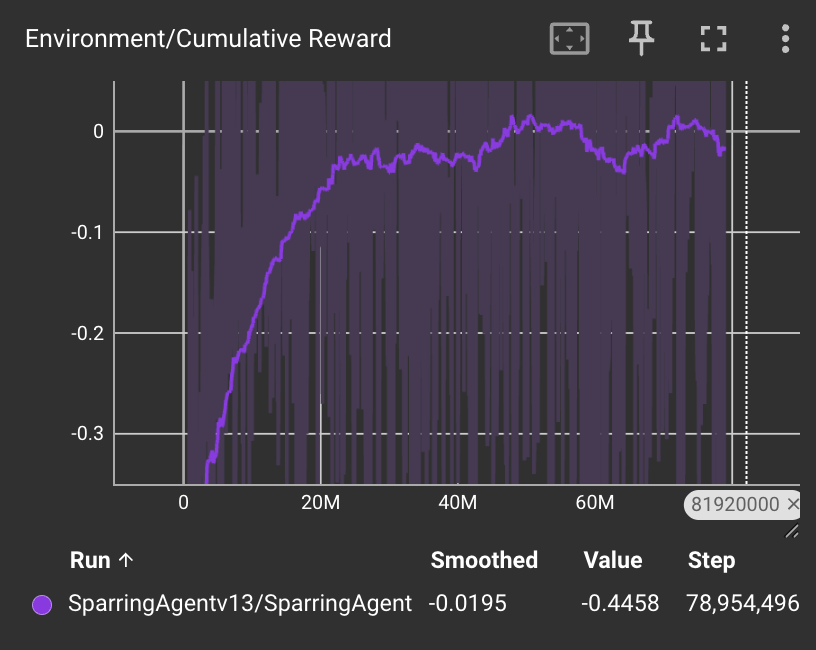
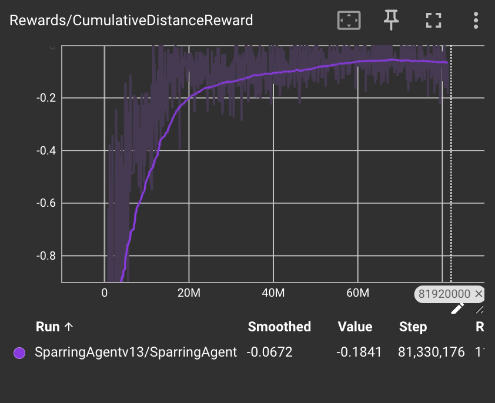
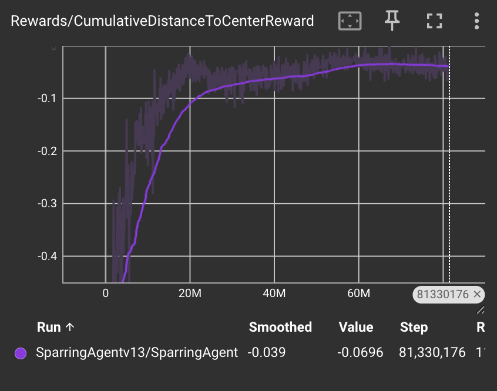
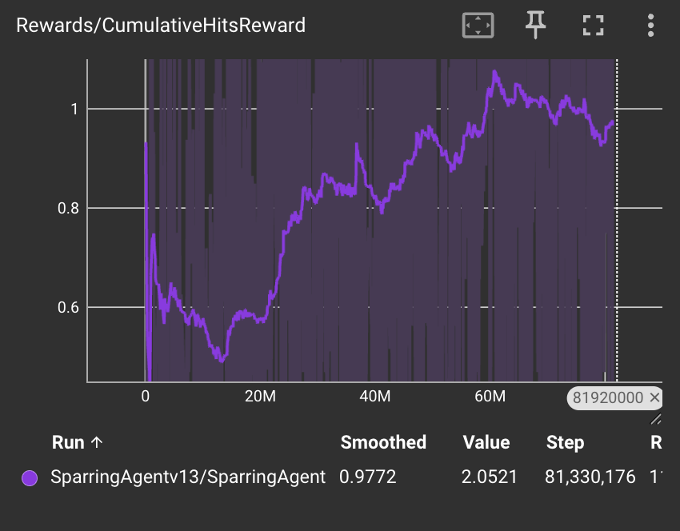

<h1 align="center">NeuroStrike</h1>

    NeuroStrike is a Unity research project that explores self-play reinforcement learning between two agents in a sparring environment. The ultimate goal of an agent in this RL environment is to land as many attacks as possible on the opponent while minimizing as many attacks landed on itself through effective movement and blocking. This project aims to build an RL framework for agents to learn effective strategies for sparring through observation and reward tuning.

 

## Technical Article

### Unity Environment, Physics, Interactions
- The Unity environment explores a 3D setup, with the arena setup being a simple ground & 4-wall setup for agent movement while preventing agents from walking off the map
- Each agent is equipped with a humanoid rig, rigidbody, capsule colliders 
    - One global capsule collider is applied to the entire agent to prevent agents from falling through the ground
- Agents have camera following functionality, which can be toggled in Hierarchy

### Game Elements
- Multiple capsule colliders are applied to each body part of the humanoid rig which act as both hitboxes (activated via attack animation) and hurtboxes (always applied to an agent, activated on a received hit)
- Processing agents makes use of a Finite State Machine (FSM) to control what state the agent is in and what actions can be taken in each state
- An animation controller applied to each agent since all actions in the environment are animations  

### Reinforcement Learning, Methods, Results
In this project, agents make use of **self-play**, a method where each agent are loaded with the same model and interact with each other in the same environment to get better overtime, thus learning to become better by playing itself.

#### Methods & Results

**Observation Space**
- An observation space of size 22 is passed in as the input to the agent's neural network, specifying information on:
    - Position (y-position not used since agent's cannot move in the vertical axis)
    - Linear and angular velocity for movement
    - Angle facing towards the opponent
    - Distance to opponent
    - Current state (based on FSM), mapped as an integer index
    - Current move (mapped as an integer index), within the current state
    - Boolean specifying if the agent is currently doing a move
    - Number of hits currently received
- Additionally, each agent adds its opponent's observations to its own observation space, to help encourage behaviour based on what the opponent is doing 

**Action Space**
- An action space of size 33 (discrete branch of 1) is sampled by the agent. All types/states of actions (such as attacks, movement, blocking) are appended to build a full moveset, as agents can only take one action at a time. 

**Rewards**
- The reward functions which were used are listed below:
    - Note: All rewards follow a zero-sum structure (unless otherwised specified). This means that an agent's gain (e.g. +5.0 reward) is the same as its opponent's loss (e.g. -5.0 reward).

| Reward Function | Type | Reward Value |
| -------- | ------- | ------- |
| Attack Blocked Reward | Sparse | +4.0 (Player) / +1.0 (Opponent) |
| Attack Landed Reward | Sparse | +5.5 (Head Hit) / +4.5 (Side Hit) / +4.0 (Body Hit) |
| Distance Reward | Shape | (Change in Position Vector $\cdot$ Distance to Opponent Vector) $\times$ 0.5 |
| Distance to Center Reward | Shape | (Previous Distance Vector - Current Distance Vector) $\times$ 1.5f (If moving towards center)    -0.1 (If moving away from center) |

**Training**
- For training, both Proximity Policy Optimization (PPO) and Soft-Actor Critic (SAC) algorithms were explored as potential optimization methods for learning. 
- Training made use of 24 parallelized environments for speeding up training by allowing the agent to collect experience faster across multiple environments.
- The model was trained for 81,345,552 timesteps before converging to the final model.

**Results**

- **PPO** was used as the choice for the final algorithm since SAC required too many computational resources. 
    - Since SAC is an off-policy algorithm, it makes use of a large replay buffer where the size of the buffer increases with the length of an episode by a factor of 1000. Since this environment does not have a specific endgoal/done state, a larger episode length of 5000 timesteps was used to allow agents sufficient time to explore the environment. This made SAC computationally unfeasible for this problem. Additionally, SAC's use of entropy made action choices very random, which led to decreasing cumulative rewards at the beginning of training, which is not desired. 
    - PPO proved to have better reward optimization, due to PPO's clipping technique for stability and sample efficiency where PPO can take multiple optimization epochs using the same batches of data during training. As a on-policy algorithm, PPO was also generally much faster and computionally less expensive.

- Using PPO, the reward data of the final run was recorded. These figures show the smoothed learning curves of several reward functions used during training that demonstrate effective reward tuning and optimization overtime:

|  |  |
| --- | --- |
|  |  |

### Conclusion 
NeuroStrike is an RL framework that enables agents in a Unity 3D sparring environment to learn effective fighting strategies using PPO self-play. PPO proved to be the algorithm of choice for better optimization and performance, due to its computation time, stability, and efficiency. The tuning of good observations and reward functions have led to interesting and effective behaviour extracted from the agent. NeuroStrike is an interesting project that combines the practice of martial arts with AI agents, and it may have the potential for being extended for a wider or deeper application in the future!
